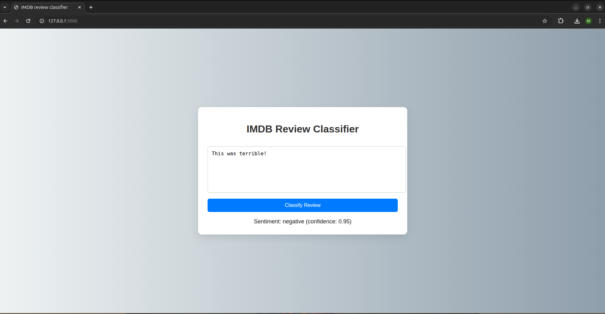

# Simple IMDB Review Classifier with Scikit-Learn

This project demonstrates a simple machine learning pipeline using Scikit-learn for binary sentiment/review classification (positive vs negative reviews). It uses a small dataset of **5,000 reviews** — 2,500 positive and 2,500 negative. 
It supports:
- Command-line prediction
- A Flask API
- A web interface (HTML/JS)

## To run this project

## 1 clone the repository

```bash
git clone https://github.com/Musiemhy/imdb-review-classifier.git
```

## 2 Setup
Install dependencies with:
```bash
pip install -r requirements.txt
```

## 3 Train the Model
### Note: You can skip this step if you wish to use the already trained model

Make sure there are IMDB dataset in `imdb_data/positive` and `imdb_data/negative` folders. and you can delete the models folder aswell.

```bash
python train.py
```

This will save the model as:
```bash
models/sentiment_model.joblib
```

## 4 Predict from Command Line
You can run a prediction like this:
```bash
python predict.py "I loved this movie!"
```

Example Output:
```
Sentiment: positive (confidence: 0.80)
```

## 5 Run the Flask API

Start the Flask app with: 

```bash
flask run
```
or 

```bash
python app.py
```

The API will be available at:
```bash
http://127.0.0.1:5000/predict
```

Then you can make either a curl request by using another terminal:
```bash
curl -X POST http://127.0.0.1:5000/predict -H "Content-Type: application/json" -d '{"text":"This was terrible!"}'
```

Example Output:
```json
{"confidence":0.95,"sentiment":"negative"}
```

or Test in the Browser by visiting: 
```bash
http://127.0.0.1:5000/
```
and typing in a review (like "This was terrible!"), then hiting Classify Review, and you will see sentiment + confidence right away.

What it looks like:
